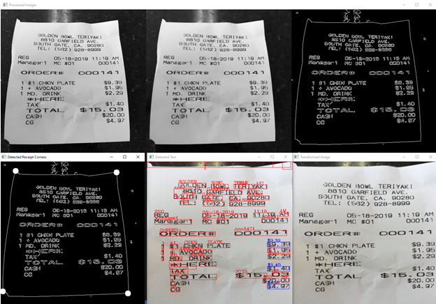

<!-- PROJECT LOGO -->
<br />
<p align="center">
  

  <h3 align="center">OpenCV Receipt Reader</h3>
  <p align="center">
  A Computer Vision and Text Recognition Program.
  </p>
</p>

<!-- TABLE OF CONTENTS -->
<details open="open">
  <summary>Table of Contents</summary>
  <ol>
    <li>
      <a href="about-this-project">About This Project</a>
    </li>
    <li>
      <a href="getting-started">Getting Started</a>
    </li>
    <li>
      <a href="how-it-works">How It Works</a>
    </li>
  </ol>
  
<!-- ABOUT THIS PROJECT -->
# About This Project
ReceiptReader is a python project that extracts data from an image of a receipt and outputs the data in an organized json format. Text extraction is accomplished using pytesseract and image processing is accomplished using opencv. Data is organized by location of the text on the receipt.
<!-- GETTING STARTED-->
# Getting Started
## Usage
### Prerequisites
This project requires tesseract and opencv to be installed and was tested in Python 3.9 .
```sh
  pip install tesseract
  pip install opencv-python
```
### How to Use
```sh
  python Reader.py 'filename' -show
```
The '-show' flag will display images of the receipt along each step of image preprocessing.
<!-- HOW IT WORKS -->
# How It Works
  
<p align="center">
    
<p>

## Known Issues
Current known issues in this project
* Cropped Images do not maintain aspect ratio
* Regex leaves lots of room for errors
* Does not that text is upright before reading

This project is currently shelved and these issues are not planned to be fixed.
